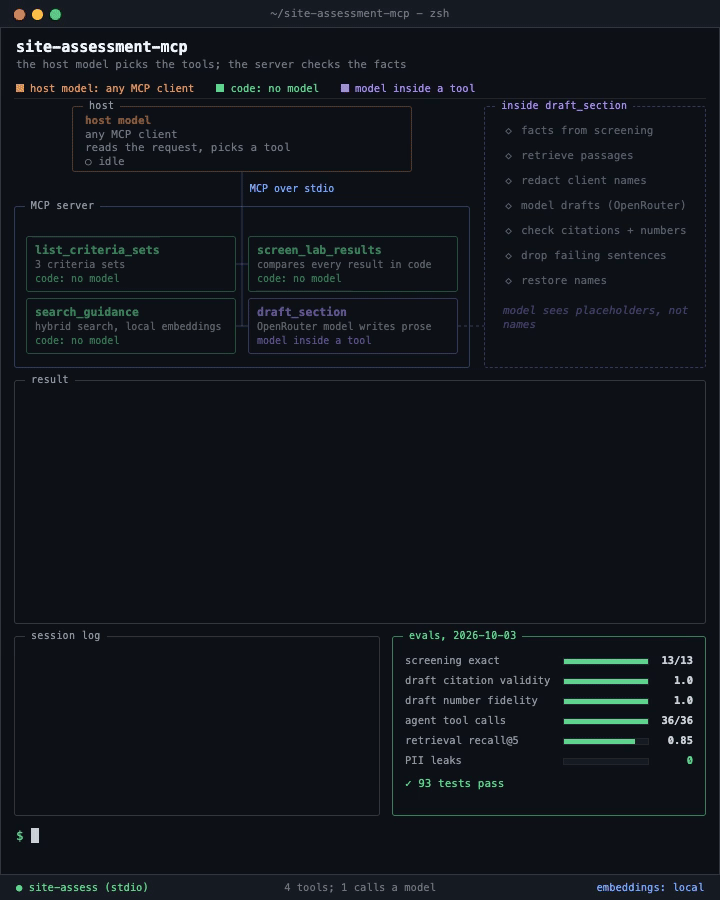

# Contaminated Land MCP

An MCP server that gives Claude, or any MCP client, cited guidance search, code-based lab-result screening and guarded report drafting for contaminated-land site assessment.



*A three-turn run on DEMO-03, replayed from a real agent transcript (eval case a09): screen, search the guidance, draft. Every value on screen comes from `demo/video/data.json`, which names its sources. [MP4](demo/demo.mp4), rendered with `uv run --with playwright python demo/video/render.py`.*


*Terminal demo of `screen_lab_results` and `search_guidance`, rendered from `demo/demo.tape` with vhs.*

## Overview

Contaminated-land site assessment means comparing lab results with published criteria, finding the right page in thousands of pages of standards, and writing the results section of a report. This server lets Claude do those three jobs with the numbers and citations kept under code control. It runs locally from Claude Desktop, Claude Code or any MCP client on public Australian guidance (NEPM) and synthetic lab data.

It is for people evaluating the design: how to put guardrails around a model inside an MCP server. It is a portfolio demo of how to put guardrails around a model inside an MCP server. It produces drafts for a qualified person to check; nothing here is a finding, an opinion or advice.

## Features

All four tools are read-only. Only `draft_section` calls a language model.

| Tool | What it does | Model call |
|---|---|---|
| `list_criteria_sets` | Lists the criteria sets that screening accepts | No |
| `search_guidance` | Hybrid search (keyword plus vector) over the guidance; every passage carries document, page and section | No |
| `screen_lab_results` | Compares every result for a site with the criteria in plain Python; each exceedance cites document, page and table; anything not comparable is listed under `not_screened` | No |
| `draft_section` | Drafts the results and discussion section from the screening output and guidance passages, behind redaction and citation checks | Yes |

Results come back as structured data plus a short text rendering. Where the host supports MCP Apps, the exceedance table renders inline.

## Architecture

```
Claude Desktop / Claude Code / any MCP client   (the host model picks the tools)
        |  MCP over stdio
        v
contaminated-land server (Python, FastMCP)
  search_guidance ----> local index (LanceDB: vector + full-text, rank fusion)
  screen_lab_results -> pure Python: lab CSV x criteria table, source page on every row
  draft_section ------> guard pipeline (below)
```

`draft_section` guard pipeline:

```
facts from screening -> retrieve passages -> redact client names -> model drafts (OpenRouter)
  -> check citations + numbers -> drop failing sentences -> restore names
```

Tool inputs and outputs are in [docs/02-architecture.md](docs/02-architecture.md).

## Quickstart

Needs [uv](https://docs.astral.sh/uv/).

```bash
uv sync
uv run python ingest/fetch_sources.py    # downloads the guidance PDFs listed in data/sources.yaml
uv run python ingest/build_index.py      # parses them and builds the local index (CPU only, one-time; tens of minutes on a cold parse, about 6 min when data/cache/docling/ exists)
cp .env.example .env                     # only needed for draft_section; add OPENROUTER_API_KEY
```

Claude Desktop: add this to `claude_desktop_config.json` (replace the path), then restart Claude Desktop.

```json
{
  "mcpServers": {
    "contaminated-land": {
      "command": "uv",
      "args": ["--directory", "/path/to/contaminated-land-mcp", "run", "contaminated-land-mcp"],
      "env": { "OPENROUTER_API_KEY": "<your key, only needed for draft_section>" }
    }
  }
}
```

Claude Code:

```bash
claude mcp add contaminated-land -e OPENROUTER_API_KEY=<your key> -- uv --directory /path/to/contaminated-land-mcp run contaminated-land-mcp
```

HTTP mode: `uv run contaminated-land-mcp --http --port 8000` serves streamable HTTP instead of stdio. It binds to localhost and has no authentication, so use it locally only.

Try: "Screen the results for site DEMO-03 against the residential criteria", then "What does the guidance say about the exceedances?", then "Draft the results section."

## Configuration

| Variable | Used by | Notes |
|---|---|---|
| `OPENROUTER_API_KEY` | `draft_section`, LLM-based evals | Never commit it |
| `CONTAMINATED_LAND_MODEL` | `draft_section` | OpenRouter model id. Default `deepseek/deepseek-v4.1-flash`, for example `anthropic/claude-sonnet-5.5` |
| `CONTAMINATED_LAND_JUDGE_MODEL` | `draft_faithfulness` eval | Optional; a different family from the drafting model is better |

The chat model in Claude Desktop or Claude Code is Claude. Separately, `draft_section` calls the model above server-side through OpenRouter. The DeepSeek default's price moves: $0.30 / $1.20 per Mtok on 2026-10-02, $0.02 / $0.42 early on 2026-10-03, back to $0.30 / $1.20 later that day; check the catalog. The owner runs local evals on the free `stealth/space-bunny-alpha` ($0 / $0), which the OpenRouter catalog lists as expiring 2026-10-05; after that date `CONTAMINATED_LAND_MODEL` must go back to DeepSeek. Stealth models may log prompts; the demo data is fictional and redacted, and the guidance documents are public.

## Evaluation

Tasks are defined in [docs/04-evaluation.md](docs/04-evaluation.md) and live in `evals/`. Measured on 2026-10-03 with inspect_ai 0.3.275 on the code before the first commit, 3 samples (DEMO-01/02/03), temperature 0. Runs A to C used one draw each; the manual-review rerun used 3 draws for drafts and agent cases and was graded by hand, not by a judge model.

| Task | Result | Gate or target |
|---|---|---|
| `screening_exact` | 13 / 13 cases exact (accuracy 1.000); expected outputs hand-computed from the criteria tables, independently of `screening.py` | Gate: 100% |
| `pii_leak` | Offline echo model: no_leak 1.0, round_trip 1.0. Real mode, `deepseek/deepseek-v4.1-flash`: no_leak 1.0, redacted_something 1.0. Real mode, `stealth/space-bunny-alpha`: no_leak 1.0, redacted_something 1.0. With redaction disabled the offline task scores 0.000; the check is sensitive to a missing redaction | Gate: 0 leaks |
| `retrieval_citation` | recall@5 0.85, MRR 0.80 (hybrid); 20 questions over 3 documents, 1712 chunks. | Target: recall@5 >= 0.8 |
| `draft_faithfulness` | Final run C, drafter `stealth/space-bunny-alpha`, judge `google/gemini-3.5-flash-lite`: citation validity 1.0 raw and 1.0 after the validator; number_fidelity 1.0; claim_support 0.933; manual rerun, 9 draws, no judge: cited sentences supported 54 / 56, uncited sentences supported by FACTS 124 / 127 | Citation validity 100% after validator |
| `agent_tool_use` | Run 2: right tools and arguments 36 / 36; `stealth/space-bunny-alpha` acts as the MCP host over real stdio, 12 cases x 3 draws. a09 on the final code 3 / 3 PASS | Reported |

Retrieval ablation, same 20 questions (recall@5 / MRR, after the chunking and ranking fixes):

| Mode | recall@5 / MRR | recall@5, table lookups | recall@5, narrative |
|---|---|---|---|
| bm25 | 0.90 / 0.72 | 0.75 | 1.00 |
| vector | 0.85 / 0.75 | 0.75 | 0.92 |
| hybrid (default) | 0.85 / 0.80 | 0.75 | 0.92 |

The chunking and ranking fixes raised MRR in every mode. Per-run rows with token counts and cost, the prompt history and the OCR assessment are in [evals/README.md](evals/README.md).

To run (from the repo root; full commands for every task in [evals/README.md](evals/README.md)):

```bash
uv run --frozen --no-sync inspect list tasks evals                                    # every task loads
uv run --frozen --no-sync inspect eval evals/screening_exact.py --model mockllm/model --display plain --log-dir /tmp/contaminated-land-mcp-evals
```

## Project layout

```
src/contaminated_land/   server, screening, retrieval, drafting, redact, llm, types
ingest/                  fetch_sources.py, build_index.py
data/                    sources.yaml, criteria/, lab/ (synthetic); cache/ is gitignored
evals/                   inspect_ai tasks, golden sets
demo/                    vhs terminal demo, animated walkthrough
docs/                    spec, architecture, data, evaluation, security, decisions
tests/                   pytest
```

## Design decisions

- **Numbers come from code, not the model.** Screening is deterministic Python; the same input gives the same output. A validator checks every number in the draft against the screening output ([D6](docs/08-decisions.md)).
- **Citations are validated.** Every claim that is not a screening number must cite `[chunk_id]`, and each id must be one of the passages supplied to the model; otherwise the sentence is removed and listed in `warnings` ([D3](docs/08-decisions.md)).
- **Redaction before the model provider.** Client names and site addresses become placeholders before the text leaves the machine and are restored in the returned draft.
- **Guidance text is untrusted.** Tool descriptions state that passages are reference text, not instructions, and the drafting prompt delimits them.
- **Synthetic data only.** No real client or site data, ever ([D11](docs/08-decisions.md)).

Every decision with its alternative and status: [docs/08-decisions.md](docs/08-decisions.md).

## Security

The server exposes only its own four read-only tools. Threat model, redaction design and the release checklist are in [docs/06-guardrails-security.md](docs/06-guardrails-security.md).

## Data and licences

- Guidance PDFs are fetched at install time from the publishers listed in `data/sources.yaml`; they are not committed. The WA DWER guideline is not redistributed here.
- Criteria values are transcribed by hand from the fetched sources, each with document, page and table recorded, and checked by tests. No value is taken from memory or from a model.
- Lab data and sites are sample data created for this demo, labelled as such; no real client or site data. Details: [docs/03-data.md](docs/03-data.md).

## License

Code: MIT, see [LICENSE](LICENSE). The licence covers this repository only. The guidance documents are not included and keep their publishers' terms (see Data and licences above).
